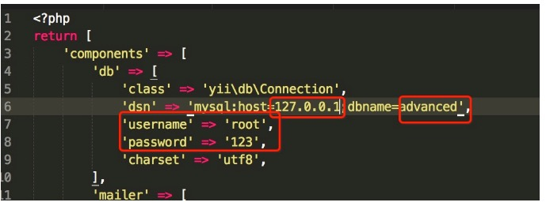
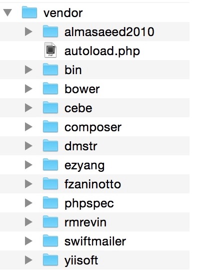
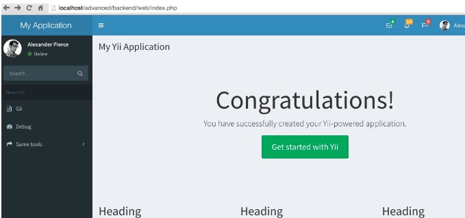
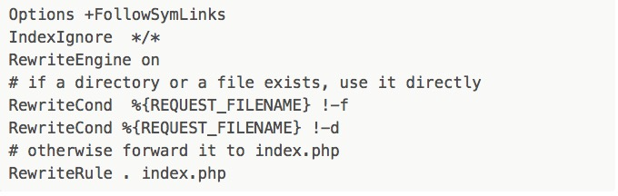
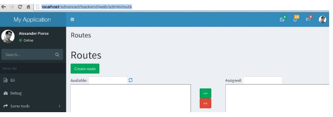
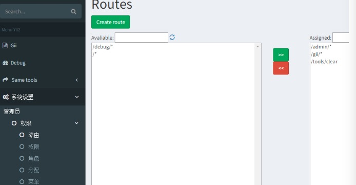

<link href="markdown.css" rel="stylesheet">
# yii2 学习笔记

## 修改默认控制器
> 'defaultRoute' => 'welcome' ,//(在config配置文件中$config下添加)

## 一些常用的文件类库

> yii\Helpers\Html;//这个类库 提供一些html格式文件输出

> yii\widgets\ActiveForm;//这个类库 提供了form表单的提交等


## 控制器生命周期

处理一个请求时，应用主体 会根据请求路由创建一个控制器，控制器经过以下生命周期来完成请求：

* 在控制器创建和配置后，yii\base\Controller::init() 方法会被调用。

* 控制器根据请求操作ID创建一个操作对象:

1 如果操作ID没有指定，会使用yii\base\Controller::defaultAction默认操作ID；

2 如果在yii\base\Controller::actions()找到操作ID，会创建一个独立操作；

3 如果操作ID对应操作方法，会创建一个内联操作；

4 否则会抛出yii\base\InvalidRouteException异常。

* 控制器按顺序调用应用主体、模块（如果控制器属于模块）、控制器的 beforeAction() 方法；

1 如果任意一个调用返回false，后面未调用的beforeAction()会跳过并且操作执行会被取消； action execution will be cancelled.

2 默认情况下每个 beforeAction() 方法会触发一个 beforeAction 事件，在事件中你可以追加事件处理操作；

* 控制器执行操作:

1 请求数据解析和填入到操作参数；

* 控制器按顺序调用控制器、模块（如果控制器属于模块）、应用主体的 afterAction() 方法；

1 默认情况下每个 afterAction() 方法会触发一个 afterAction 事件，在事件中你可以追加事件处理操作；

* 应用主体获取操作结果并赋值给响应.

## 收发邮件
Yii 支持组成和发送电子邮件。然而，该框架提供的只有内容组成功能和基本接口。实际的邮件发送机制可以通过扩展提供， 因为不同的项目可能需要不同的实现方式，它通常取决于外部服务和库。

大多数情况下你可以使用 yii2-swiftmailer 官方扩展。

### 配置

件组件配置取决于你所使用的扩展。一般来说你的应用程序配置应如下：

`
 return [
    //....
    'components' => [
        'mailer' => [
            'class' => 'yii\swiftmailer\Mailer',
        ],
    ],
];
`

### 基本用法

一旦 “mailer” 组件被配置，可以使用下面的代码来发送邮件：

`
Yii::$app->mailer->compose()
    ->setFrom('from@domain.com')
    ->setTo('to@domain.com')
    ->setSubject('Message subject')
    ->setTextBody('Plain text content')
    ->setHtmlBody('<b>HTML content</b>')
    ->send();
`

### 撰写邮件内容

Yii 允许通过特殊的视图文件来撰写实际的邮件内容。默认情况下，这些文件应该位于 “@app/mail” 路径。

一个邮件视图内容的例子：
> <?php
> use yii\helpers\Html;

> use yii\helpers\Url;

> /* @var $this \yii\web\View view component instance */

> /* @var $message \yii\mail\BaseMessage instance of newly created mail message */

> ?>

> <h2>This message allows you to visit our site home page by one click</h2>

> <?= Html::a('Go to home page', Url::home('http')) ?>


为了通过视图文件撰写正文可传递视图名称到 compose() 方法中：


`
Yii::$app->mailer->compose('home-link') // 渲染一个视图作为邮件内容
    ->setFrom('from@domain.com')
    ->setTo('to@domain.com')
    ->setSubject('Message subject')
    ->send();
`

### yii2 发送邮件（最全配置文件）

1 在配置文件main-local.php components=>[]里面配置

`
"mailer" => [
    "class" => "yii\swiftmailer\Mailer",
    "useFileTransport" =>false,//这句一定有，false发送邮件，true只是生成邮件在runtime文件夹下，不发邮件
    "transport" => [
    "class" => "Swift_SmtpTransport",
    "host" => "smtp.163.com",  //每种邮箱的host配置不一样
    "username" => "15618380091@163.com",
    "password" => "*******",
    "port" => "25",
    "encryption" => "tls",
    ],
    "messageConfig"=>[
    "charset"=>"UTF-8",
    "from"=>["15618380091@163.com"=>"admin"]
    ],
],
`

2 controller控制器中 代码：

`
$mail= Yii::$app->mailer->compose();
$mail->setTo('***********@qq.com');
$mail->setSubject("邮件测试");
//$mail->setTextBody('zheshisha ');   //发布纯文字文本
$mail->setHtmlBody("<br>问我我我我我");    //发布可以带html标签的文本
if($mail->send())
    echo "success";
else
    echo "failse";
die(); 
`
ok，这样就可以发送邮件了

如需加载模板 把$mail= Yii::$app->mailer->compose(); 

修改成 $mail= Yii::$app->mailer->compose('xiaoma',['aa'=>222]); 

注:aa是想xiaoma.php里面传递的参数。

3 邮件模板 xiaoma.php里面的代码 ：

`
<?php
use yii\helpers\Html;
/* @var $this yii\web\View */
/* @var $user common\models\User */
$resetLink = Yii::$app->urlManager->createAbsoluteUrl(['site/reset-password', 'token' => $aa]);
?>
< a href="#" ><?php echo $resetLink ?></a>
`

3 加载模板的邮件代码：

`
$mail= Yii::$app->mailer->compose('xiaoma',['aa'=>222]);
       $mail->setTo('1401619705@qq.com');
       $mail->setSubject("邮件测试");
       $mail->setTextBody('zheshisha ');
       if($mail->send())
           echo "success";
       else
           echo "failse";
     die();
`

通过以上配置就ok了


## yii2高级模板中自定义类库

* 我定义的一般在common这个目录下创建一个文件夹，如：

> common\libs;

> common\libs\Tools.php;

* 在controller中调用刚刚创建的这个类库，如：

> use common\libs\Tools;  //这个是命名空间的调用

> Tools::test();  //控制器中的调用，这个是静态方法


## yii2 修改布局(layout)

* 方案1:控制器内成员变量

> public $layout = false; //不使用布局

> public $layout = "main"; //设置使用的布局文件

* 方案2：控制器成员方法内

> $this->layout = false; //不使用布局

> $this->layout = "main"; //设置使用的布局文件

* 方案3：视图中选择布局

> $this->context->layout = false; //不使用布局

> $this->context->layout = 'main'; //设置使用的布局文件

## yii2 国际化

1 在配置文件 common/config/main-local.php配置文件中'components' => []添加一下内容：

`
'i18n' => [
    'translations' => [
    'app*' => [
    'class' => 'yii\i18n\PhpMessageSource',
    'basePath' => '@common/messages',
    //'sourceLanguage' => 'en-US',
    /**
    'fileMap' => [
    'app' => 'app.php',
    ],
    */
    ],
    ],
],
`

2 在公共加载文件中设置语言 如下：

`
Yii::$app->language = 'zh-cn';
`

3 在common文件下创建如下文件：

> messages

> ├── en-US

> │  └── app.php

> └── zh-CN

> │   └── app.php


4 在文件中调用如下：

`
<?= Yii::t('app','test'); ?>
`


## yii2 urlManager和Url生成url

`
<?php 
use yii\Helpers\Url;
index.php?r=site/index;
Url::to(['/site/index']);
index.php?r=site/index/id/102;
Url::to(['/site/index',['id'=>102]]);
`

## yii2搭建完美后台并实现rbac权限控制实例教程

* 安装yii2

未安装的请参考yii2史上最简单式安装教程，没有之一

已安装的请继续看下一步操作

* 配置数据库

1 配置数据库

修改common/config/main-local.php 实际项目中本地的数据库往往跟线上数据库不一致，

我们这里配置到main-local.php就可以了，产品上线后，我们可以使用git或者svn忽略掉main-local.php，线上直接部署。

我们这里使用的mysql数据库，配置如下



当然啦，上面红圈圈的信息需要你自己手动修改掉，要是十分巧合跟我的一样那就不用在修改了

2 创建user数据表，我们后面要实现后台登陆

说明：user表和menu表的创建可以参考我们后面下载的组件yii2-admin里面的sql,具体目录位于

vendor\mdmsoft\yii2-admin\migrations\schema-mysql.sql

```
CREATE TABLE `user` (
`id` int(11) NOT NULL AUTO_INCREMENT COMMENT "自增ID",  
`username` varchar(255) NOT NULL COMMENT "用户名",  
`auth_key` varchar(32) NOT NULL COMMENT "自动登录key",  
`password_hash` varchar(255) NOT NULL COMMENT "加密密码",  
`password_reset_token` varchar(255) DEFAULT NULL COMMENT "重置密码token",  
`email` varchar(255) NOT NULL COMMENT "邮箱",  
`role` smallint(6) NOT NULL DEFAULT "10" COMMENT "角色等级",  
`status` smallint(6) NOT NULL DEFAULT "10" COMMENT "状态",  
`created_at` int(11) NOT NULL COMMENT "创建时间",  
`updated_at` int(11) NOT NULL COMMENT "更新时间",  
PRIMARY KEY (`id`)
) ENGINE=InnoDB AUTO_INCREMENT=0 DEFAULT CHARSET=utf8 COMMENT="用户表";
```

3 访问frontend站点，先注册个用户

注册成功后，右上角会显示登陆的状态，我们后面会用到这个注册的用户

接下来我们要开始配置后台的模板了。

* 利用AdminLTE渲染后台模板

后台的模板我们采用利用 AdminLTE（Backend theme for Yii2 Framework）

插播一曲：AdminLTE是一个完全响应管理模板。基于Bootstrap3框架，易定制模板。适合多种屏幕分辨率，从小型移动设备到大型台式机。

内置了多个页面，包括仪表盘、邮箱、日历、锁屏、登录及注册、404错误、500错误等页面。

1 3.1 安装AdminLTE

https://github.com/dmstr/yii2-adminlte-asset

打开上面的链接，按照操作步骤进行安装

这里我简述下自己的安装步骤，cd advanced后，

> 因为是mac，这里直接composer进行安装就行了

> composer require dmstr/yii2-adminlte-asset "2.*"


安装成功后，vendor目录下会多几个文件夹，如下



2 yii2配置整合AdminLTE,搭建帅气上档次的后台

下面我们配置下backend/config/main.php先预览下效果，小心脏捉急的巴不得赶紧尝尝战果

`
"components" => [
    "view" => [
        "theme" => [
            "pathMap" => [
                "@app/views" => "@vendor/dmstr/yii2-adminlte-asset/example-views/yiisoft/yii2-app"
             ],
        ],
    ],
],
`



nice,页面瞬间好看多了。

问题来了，我们是在components里面单独配置的theme,这样以后要修改布局文件什么的是很不方便滴，下面我们把不局文件拷贝下来覆盖掉yii自带的layout.

把vendor/dmstr/yii2-adminlte-asset/example-views/yiisoft/yii2-app目录下的layouts和site拷贝

覆盖掉backend/views/目录下的lauouts和site对应的文件

覆盖后记得屏蔽掉 components下面view的配置项

到此，后台模板的搭建告一段落，si不si很happy

* 下面我们用yii的rbac实现后台的权限控制(这个配置可以配置，也可以不配置)

1 我们先配置下简短路由

backend/config/main.php文件的compontents加上下面的配置

`
"urlManager" => [    
    //用于表明urlManager是否启用URL美化功能，在Yii1.1中称为path格式URL，    
    // Yii2.0中改称美化。   
    // 默认不启用。但实际使用中，特别是产品环境，一般都会启用。   
    "enablePrettyUrl" => true,    
    // 是否启用严格解析，如启用严格解析，要求当前请求应至少匹配1个路由规则，    
    // 否则认为是无效路由。    
    // 这个选项仅在 enablePrettyUrl 启用后才有效。    
    "enableStrictParsing" => false,    
    // 是否在URL中显示入口脚本。是对美化功能的进一步补充。    
    "showScriptName" => false,    
    // 指定续接在URL后面的一个后缀，如 .html 之类的。仅在 enablePrettyUrl 启用时有效.
    "suffix" => "",
    "rules" => [
        "<controller:\w+>/<id:\d+>"=>"<controller>/view",
        "<controller:\w+>/<action:\w+>"=>"<controller>/<action>"
    ],
],
`

接下来在项目的根目录 backend/web下面创建.htaccess文件并添加如下内容，这个文件你都创建不下来，看来是真需要再磨练磨练哦




当然，你的apache必须要开启rewrite模块。

下面我们访问下gii模块测试下

http://localhost/advanced/backend/web/gii

校验是可以的。

2 创建权限控制所需要的数据表

当然，这些yii2都给我们准备好了。

打开 vendor/yiisoft/yii2/rbac/migrations/schema-mysql.sql 文件，依次创建数据表

```
`auth_assignment`;
`auth_item_child`;
`auth_item`;
`auth_rule`;
另外补充菜单menu表，需要的自行创建
说明：user表和menu表的创建可以参考 vendor\mdmsoft\yii2-admin\migrations\schema-mysql.sql
CREATE TABLE `menu` (  
`id` int(11) NOT NULL AUTO_INCREMENT,  
`name` varchar(128) NOT NULL,  
`parent` int(11) DEFAULT NULL,  
`route` varchar(256) DEFAULT NULL,  
`order` int(11) DEFAULT NULL,  
`data` text,  
PRIMARY KEY (`id`),  
KEY `parent` (`parent`),  
CONSTRAINT `menu_ibfk_1` FOREIGN KEY (`parent`) REFERENCES `menu` (`id`) ON DELETE SET NULL ON UPDATE CASCADE
) ENGINE=InnoDB DEFAULT CHARSET=utf8
```


3 下载安装 yii2-admin

参考 https://github.com/mdmsoft/yii2-admin

按照步骤一步一步安装即可，同adminlte的安装

安装好了我们会在vendor目录下面看到 mdmsoft目录

4 权限配置

打开backend/config/main.php修改配置

`
"modules" => [    
    "admin" => [        
        "class" => "mdm\admin\Module",   
    ],
],
"aliases" => [    
    "@mdm/admin" => "@vendor/mdmsoft/yii2-admin",
],
//这里必须添加authManager配置项
"components" => [   
     ...    
    //components数组中加入authManager组件,有PhpManager和DbManager两种方式,    
    //PhpManager将权限关系保存在文件里,这里使用的是DbManager方式,将权限关系保存在数据库.    
    "authManager" => [        
        "class" => 'yii\rbac\DbManager', //这里记得用单引号而不是双引号        
        "defaultRoles" => ["guest"],    
    ],   
     ...
],
'as access' => [
   //ACF肯定是要加的，因为粗心导致该配置漏掉了，很是抱歉
    'class' => 'mdm\admin\components\AccessControl',
    'allowActions' => [
        //这里是允许访问的action
        //controller/action
    ]
],
`

5 我们访问下权限模块检验下效果如何

http://localhost/advanced/backend/web/admin/route



嗯，界面是有的了，下面我们加快脚步验收下我们的权限这块到底成还是不成呢？

一般来说到这一步就ok的了。后面的可以自己摸索着添加路由分配权限了。

下面我们在左侧菜单上把权限的栏目加上,代码可直接复制，放置于 `<section class="sidebar"></section>`内

```
 <ul class="sidebar-menu">>
    <li class="treeview"> 
        <a href="#">
            <i class="fa fa-gears"></i> <span>权限控制</span> 
            <i class="fa fa-angle-left pull-right"></i> 
        </a> 
        <ul class="treeview-menu">
            <li class="treeview">
                <a href="/admin">管理员</a>
                <ul class="treeview-menu">
                    <li><a href="/user"><i class="fa fa-circle-o"></i> 后台用户</a></li>
                    <li class="treeview">                                
                        <a href="/admin/role">                                    
                            <i class="fa fa-circle-o"></i> 权限 <i class="fa fa-angle-left pull-right"></i>                                
                        </a>                                
                        <ul class="treeview-menu">                                    
                            <li><a href="/admin/route"><i class="fa fa-circle-o"></i> 路由</a></li>                                    
                            <li><a href="/admin/permission"><i class="fa fa-circle-o"></i> 权限</a></li>
                            <li><a href="/admin/role"><i class="fa fa-circle-o"></i> 角色</a></li>
                            <li><a href="/admin/assignment"><i class="fa fa-circle-o"></i> 分配</a></li>
                            <li><a href="/admin/menu"><i class="fa fa-circle-o"></i> 菜单</a></li>
                        </ul>
                    </li>
                </ul>
            </li>
        </ul> 
    </li> 
</ul>
```

我们看下效果图，这样一来，我们对权限进行操作就十分的方便了



如此，我们的权限控制基本告一段落了，关于权限需要说明的是：

你应该先添加路由，然后添加权限名称，后再对角色或个人进行权限的独立分配。

* 如何利用menu对菜单进行控制？

4.5步骤中我们是直接写ul li的方式对左侧菜单进行操作的，这样也是能够实现通过菜单对权限进行控制滴。但是喃，一来不方便操作，而来增加修改个什么东东都得需要我们去修改程序实现，这也TTM不方便了。还好我们家有妙招，DDV杀杀杀。

好了，又扯远了。仔细回想，是不是我们创建的123456张表还有一张menu表没有利用到喃？这货怎么利用喃？来，我们回归正题。

首选，我们访问/admin/menu/index添加几个一级菜单，姑且叫做一级1，一级2，一级3吧，哦对了，忘记添加路由了，怎么回事呢，我们先访问/admin/route/index 把左侧的路由移动到右侧，不然上面创建新菜单会失败哦。创建菜单时，[映射][数据]我们暂且不填写。

添加完毕之后呢，我们打开布局文件left.php,use两个类文件，分别是yii\bootstrap\Nav和mdm\admin\components\MenuHelper;

获取权限的操作 MenuHelper::getAssignedMenu都帮我们做好了。

ok,我们删掉4.5添加的sidebar-menu菜单，添加下面的代码试试看

`
echo Nav::widget(
    [
        "encodeLabels" => false,
        "options" => ["class" => "sidebar-menu"],
        "items" => MenuHelper::getAssignedMenu(Yii::$app->user->id),
    ]
);
`
现在菜单控制权限我们基本上是ok了，现在你可以继续添加菜单试试效果如何。

到此呢，我们的后台和rbac的权限控制可以说是做得非常完美了，如果你在尝试的过程中遇到任何问题，下面留言就好，咱们共同交流探讨。

很多人反映，菜单没出来效果，单独对菜单写了篇详细教程 [yii2 rbac权限控制之菜单menu详细教程](http://www.manks.top/article/yii2_rbac_menu)

后面发现不是我们搭建的问题，是大家不会操作的问题啊，心塞有木有 [yii2 rbac权限控制详细操作步骤](http://www.manks.top/article/yii2_rbac_description)

[原文件](http://www.manks.top/article/yii2_frame_rbac_template)